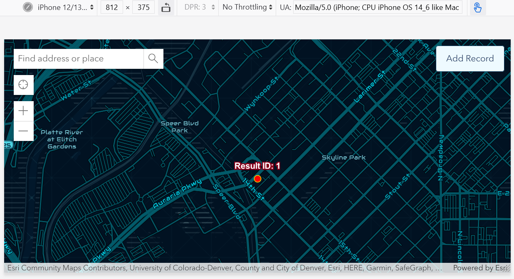

# geog576_lab4
A repo for UW-Mad Geog 576 Lab 4

## Project Summary
This project is a JavaScript-only full stack with a mobile first design that can read and write to an ArcGIS Online (AGOL) database.
<ul>
  <li>Basemap provided by ESRI</li>
  <li>Hosted & editable data using Survey123 embedded into ArcGIS online by <a href="https://uw-mad.maps.arcgis.com/home/item.html?id=beaf1c2f948949bd91e432a384654d2e" target="_blank">me</a></li>
</ul>

### Project Website
This project is hosted live on github pages: https://steslowj.github.io/geog576_lab4/

### Website Screenshot
This screenshot is taken while using Firefox developer tools, emulating a smartphone screen set to horizontal. 

